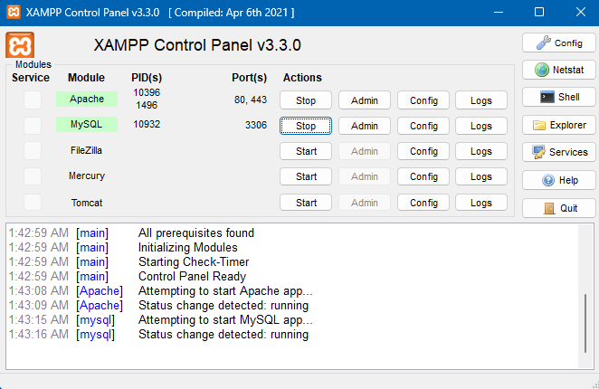
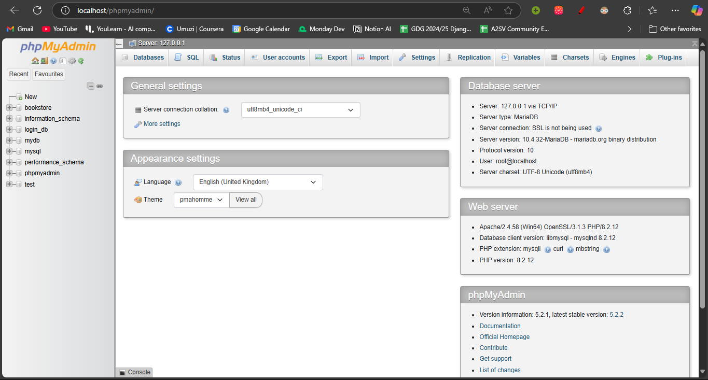
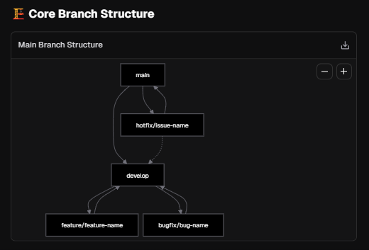

# 📚 GoodReads Clone - Developer Guide 📚

Welcome to the GoodReads Clone project! This guide will help you set up your development environment, understand the project structure, and follow best practices for contributing to the project.

## 📋 Table of Contents

- [Project Overview](#-project-overview)
- [Getting Started](#-getting-started)
  - [Prerequisites](#prerequisites)
  - [Setting Up XAMPP](#setting-up-xampp)
  - [Database Setup](#database-setup)
  - [Project Setup](#project-setup)
- [Project Structure](#-project-structure)
- [Development Workflow](#-development-workflow)
  - [Git Branching Strategy](#git-branching-strategy)
  - [Commit Guidelines](#commit-guidelines)
  - [Pull Request Process](#pull-request-process)
- [Coding Standards](#-coding-standards)
- [API Documentation](#-api-documentation)
- [Testing](#-testing)
- [Deployment](#-deployment)
- [Troubleshooting](#-troubleshooting)
- [Contributing](#-contributing)

## 🔍 Project Overview

This project is a clone of GoodReads, a social cataloging website that allows individuals to search its database of books, annotations, quotes, and reviews. Our clone implements core features including:

- 👤 User authentication and profiles
- 📖 Book catalog with search functionality
- 📚 Bookshelves (to-read, reading, read)
- ⭐ Ratings and reviews
- 💬 Comments on reviews
- 👍 Like system for reviews and comments
- 👥 Social features (following users)
- 👮 Admin functionality for managing books

## 🚀 Getting Started

### Prerequisites

Before you begin, ensure you have the following installed:

- [XAMPP](https://www.apachefriends.org/index.html) (version 8.0 or higher)
- [Git](https://git-scm.com/)
- A code editor (we recommend [Visual Studio Code](https://code.visualstudio.com/))

### Setting Up XAMPP

1. **Install XAMPP**:

   - Download and install XAMPP from the [official website](https://www.apachefriends.org/index.html)
   - Follow the installation instructions for your operating system

2. **Start XAMPP Services**:

   - Launch the XAMPP Control Panel
   - Start the Apache and MySQL services by clicking the "Start" buttons

   

3. **Verify Installation**:
   - Open your browser and navigate to `http://localhost`
   - You should see the XAMPP welcome page

### Database Setup

1. **Access phpMyAdmin**:
   - Open your browser and navigate to `http://localhost/phpmyadmin`
2. **Create the Database**:

   - Click on the "Import" tab in the top navigation bar
   - Click "Choose File" and select the `database/goodreads_clone.sql` file from the project
   - Click "Go" at the bottom of the page to execute the SQL script

   

3. **Verify Database Creation**:
   - The `goodreads_clone` database should now appear in the left sidebar
   - Click on it to explore the tables and ensure they were created correctly

### Project Setup

1. **Clone the Repository**:

   ```bash
   git clone https://github.com/Tesfamichael12/goodreads-php-backend.git
   cd goodreads-php-backedn
   ```

2. **Configure Database Connection**:

   - Open `includes/db.php`
   - Update the database connection parameters if needed:
     ```php
     private $host = "localhost";
     private $db_name = "goodreads_clone";
     private $username = "root"; // Change if you have a different username
     private $password = ""; // Add your password if you set one
     ```

3. **Copy to XAMPP htdocs**:

   - Copy or move the project folder to your XAMPP `htdocs` directory:
     - Windows: `C:\xampp\htdocs\goodreads-php-backedn`
     - macOS: `/Applications/XAMPP/htdocs/goodreads-php-backedn`
     - Linux: `/opt/lampp/htdocs/goodreads-php-backedn`

4. **Access the Project**:
   - Open your browser and navigate to `http://localhost/goodreads-php-backedn`
   - You should see the project's homepage

## 📂 Project Structure

```
backend/
├── auth/ # Authentication endpoints
│ ├── login.php
│ ├── logout.php
│ └── register.php
├── books/ # Book management endpoints
│ ├── add.php (admin)
│ ├── delete.php (admin)
│ ├── detail.php
│ ├── edit.php (admin)
│ ├── list.php
│ └── search.php
├── comments/ # Comment functionality
│ ├── delete.php
│ ├── list.php
│ └── submit.php
├── database/ # Database scripts
│ └── goodreads_clone.sql
├── docs/ # API documentation
│ ├── .htaccess
│ ├── index.php
│ └── openapi.yaml
├── includes/ # Shared utilities and components
│ ├── db.php
│ ├── swagger.php
│ └── utils.php
├── likes/ # Like functionality
│ ├── comment.php
│ └── review.php
├── reviews/ # Review functionality
│ ├── delete.php
│ ├── list.php
│ └── submit.php
├── shelves/ # Bookshelf functionality
│ ├── add.php
│ ├── list.php
│ └── remove.php
├── social/ # Social features
│ ├── feed.php
│ ├── follow.php
│ ├── followers_count.php
│ ├── following_count.php
│ └── unfollow.php
└── index.php # Main entry point
```

## 🔄 Development Workflow

### Git Branching Strategy

We follow a simplified Git Flow workflow:

1. **Main Branches**:

   - `main`: Production-ready code
   - `develop`: Integration branch for features

2. **Supporting Branches**:

   - `feature/feature-name`: For new features
   - `bugfix/bug-name`: For bug fixes
   - `hotfix/issue-name`: For critical production fixes

     

### Creating a New Branch

```bash

# For a new feature

git checkout develop
git pull
git checkout -b feature/user-profiles

# For a bug fix

git checkout develop
git pull
git checkout -b bugfix/login-issue

# For a hotfix (branch from main)

git checkout main
git pull
git checkout -b hotfix/critical-security-issue
```

### Commit Guidelines

Write clear, concise commit messages that explain what changes were made and why:

```bash
feat: Add custom shelves functionality

- Add database table for custom shelves
- Create API endpoints for CRUD operations
- Update documentation
```

Use prefixes to categorize your commits:

- `feat:` A new feature
- `fix:` A bug fix
- `docs:` Documentation changes
- `style:` Code style changes (formatting, etc.)
- `refactor:` Code changes that neither fix bugs nor add features
- `test:` Adding or updating tests
- `chore:` Changes to the build process or auxiliary tools

### Pull Request Process

1. **Create a Pull Request**:

   - Push your branch to the remote repository
   - Create a pull request to merge into `develop` (or `main` for hotfixes)
   - Use the PR template to describe your changes

2. **Code Review**:

   - Assign at least one reviewer to your PR
   - Address any feedback or requested changes

3. **Merging**:
   - PRs can be merged once they have been approved
   - Delete the branch after merging

## 📝 Coding Standards

We follow the [PSR-12](https://www.php-fig.org/psr/psr-12/) coding standard for PHP. Here are some key guidelines:

- Use 4 spaces for indentation (not tabs)
- Files MUST use only UTF-8 without BOM
- Class names MUST be declared in `PascalCase`
- Method names MUST be declared in `camelCase`
- Class constants MUST be declared in all uppercase with underscore separators
- Always use full PHP tags `<?php ?>` (not short tags)
- Always sanitize user input using the `sanitizeInput()` function
- Use prepared statements for all database queries
- Add appropriate comments for complex logic

### Security Best Practices

- Never store sensitive information in plain text
- Always validate and sanitize user input
- Use prepared statements to prevent SQL injection
- Implement proper authentication and authorization checks
- Log security-related events

## 📘 API Documentation

The API documentation is available at `http://localhost/goodreads-php-backedn/docs/` when the project is running. It provides detailed information about all available endpoints, request/response formats, and authentication requirements.

### Key Endpoints

- **Authentication**: `/auth/*`
- **Books**: `/books/*`
- **Shelves**: `/shelves/*`
- **Reviews**: `/reviews/*`
- **Comments**: `/comments/*`
- **Likes**: `/likes/*`
- **Social**: `/social/*`

## 🧪 Testing

### Manual Testing

For each feature or bug fix, test the following:

1. **Functionality**: Does it work as expected?
2. **Edge Cases**: How does it handle unexpected inputs?
3. **Security**: Are there any security vulnerabilities?
4. **Performance**: Does it perform efficiently?

### Test Accounts

The database comes with pre-configured test accounts:

- **Admin User**:

  - Email: admin@example.com
  - Password: password (hashed in the database)

- **Regular User**:
  - Email: user@example.com
  - Password: password (hashed in the database)

## 🚢 Deployment

### Preparing for Production

1. **Update Configuration**:

   - Set appropriate database credentials
   - Disable error reporting
   - Enable HTTPS

2. **Security Checklist**:

   - Remove any test accounts
   - Ensure all inputs are validated and sanitized
   - Check for proper authentication and authorization

3. **Performance Optimization**:
   - Enable PHP opcode caching
   - Optimize database queries
   - Consider implementing a caching strategy

### Deployment Steps

1. **Backup the Database**:

   - Export the current production database

2. **Deploy Code**:

   - Pull the latest `main` branch to the production server
   - Run any necessary database migrations

3. **Verify Deployment**:
   - Test key functionality
   - Monitor for any errors

## 🔧 Troubleshooting

### Common Issues

1. **Database Connection Errors**:

   - Verify database credentials in `includes/db.php`
   - Ensure MySQL service is running
   - Check if the database exists

2. **Permission Issues**:

   - Ensure the web server has read/write permissions to necessary directories

3. **API Errors**:
   - Check the PHP error log for details
   - Verify the request format matches the API documentation

## 👥 Contributing

We welcome contributions from all team members! Here's how you can contribute:

1. **Report Bugs**:

   - Use the issue tracker to report bugs
   - Include detailed steps to reproduce

2. **Suggest Features**:

   - Propose new features or improvements
   - Discuss ideas with the team before implementation

3. **Submit Changes**:

   - Follow the development workflow outlined above
   - Ensure your code adheres to our coding standards

4. **Review Code**:
   - Participate in code reviews
   - Provide constructive feedback

---

## 🎉 Thank You!

Thank you for contributing to the GoodReads Clone project!

Happy coding! 📚✨
